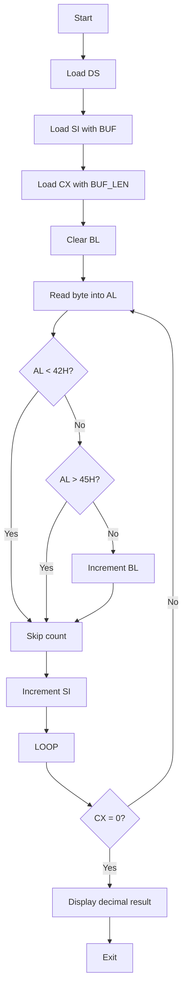
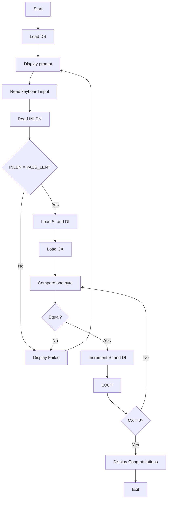

# Lab 2 Report

## Introduction

This report documents the two assembly language programs completed in Lab 2. The lab focused on low-level string handling in 16-bit x86 assembly language, including memory access, register usage, looping, conditional comparison, keyboard input, and screen output through DOS interrupt services.

The two programs address different tasks, but both require processing character data one byte at a time. This is an important part of assembly programming because string operations that are simple in high-level languages must be implemented manually using registers and control flow instructions.

## Objectives

The objectives of this lab were as follows:

1. To scan a string stored in memory and count characters that satisfy a specific ASCII condition.
2. To accept a string from the keyboard and compare it with a stored password.
3. To practice using loops, comparisons, pointers, and DOS interrupt `21H` for input and output.
4. To understand how string-oriented logic is implemented explicitly in assembly language.

## Program 1: Counting Characters in an ASCII Range

File: `Program-1.asm`

### Task Description

The first program was required to examine the following string:

```asm
BUF DB 'HELLO ABCDEFBBCCDDEE'
```

The goal was to count how many characters in this string have ASCII codes from `42H` to `45H`, inclusive, and then display the result in decimal form.

### Meaning of the ASCII Range

The hexadecimal range `42H` to `45H` corresponds to these uppercase letters:

- `42H` = `B`
- `43H` = `C`
- `44H` = `D`
- `45H` = `E`

Therefore, the program counts every occurrence of `B`, `C`, `D`, and `E` in the given string.

### Core Logic

The main idea of the program is to move through the string one character at a time, test whether the current character belongs to the required ASCII range, and increment a counter whenever the condition is true.

The following excerpt shows the key scan loop:

```asm
LEA     SI, BUF
MOV     CX, BUF_LEN
XOR     BL, BL

SCAN:   MOV     AL, [SI]
  CMP     AL, 42H
  JB      NEXT_CHAR
  CMP     AL, 45H
  JA      NEXT_CHAR
  INC     BL

NEXT_CHAR:
  INC     SI
  LOOP    SCAN
```

### Explanation of the Code

- `LEA SI, BUF` loads the starting address of the string into `SI`.
- `MOV CX, BUF_LEN` places the number of characters in `CX`, which is used by the `LOOP` instruction.
- `XOR BL, BL` clears `BL`, which is used as the counter.
- `MOV AL, [SI]` reads the current character from memory.
- `CMP AL, 42H` checks whether the character is below the lower limit.
- `JB NEXT_CHAR` skips counting if the character is too small.
- `CMP AL, 45H` checks whether the character is above the upper limit.
- `JA NEXT_CHAR` skips counting if the character is too large.
- `INC BL` increases the counter when the character falls within the range.
- `INC SI` advances to the next character.
- `LOOP SCAN` repeats the process until all characters have been checked.

### Why This Design Was Used

This design was chosen because assembly language does not provide automatic string scanning or filtering. Every operation must be stated explicitly.

- `SI` is appropriate for traversing sequential memory locations.
- `CX` works naturally with `LOOP`, which is convenient when the number of iterations is already known.
- `BL` is sufficient for the count because the expected total is small.
- Two comparisons are necessary to test whether a value lies inside a closed interval.

### Decimal Output

After the counting process is complete, the result stored in `BL` must be displayed on the screen. Since DOS does not automatically convert a binary number into decimal text, the program uses the `CMPDISP` macro to display each decimal digit.

This is necessary because:

- registers store numeric values internally
- the display requires ASCII characters
- numeric conversion must be handled by the program itself

### Result of Program 1

For the string:

```text
HELLO ABCDEFBBCCDDEE
```

the total number of characters in the required range is:

```text
12
```

### Learning Outcome from Program 1

This program provided practice in:

- reading data from memory
- using pointer registers
- performing range checks
- controlling loops with `CX`
- maintaining counters in registers
- converting and displaying a numeric result

## Program 2: Password Verification Using Repeated Input

File: `Program-2.asm`

### Task Description

The second program was required to store a password and repeatedly ask the user to enter a string from the keyboard until the entered string matches the stored password.

The stored password is:

```asm
PASSWORD DB 'HELLO'
```

The required behavior is:

1. Accept an ASCII string from the keyboard.
2. Compare the input string with the stored password.
3. If both strings are equal, display `Congratulations` and terminate.
4. If they are not equal, display `Failed` and ask for input again.

### Data Structure Used for Input

The program uses DOS interrupt `21H`, function `0AH`, to read a buffered keyboard input string. This function requires a specific memory structure:

```asm
INBUF  DB 20
INLEN  DB ?
INDATA DB 20 DUP(?)
```

### Meaning of the Input Buffer

- `INBUF` defines the maximum number of characters the user may enter.
- `INLEN` stores the actual number of characters entered.
- `INDATA` stores the characters typed by the user.

This layout is not optional. It is required by DOS function `0AH`, so the program must prepare the buffer in exactly this form.

### Core Logic

The program first displays a prompt, then reads the input, checks the length, and finally compares the characters one by one.

The following excerpt shows the main control flow:

```asm
INPUT_AGAIN:
  MOV    AH, 9
  LEA    DX, PROMPT
  INT    21H

  MOV    AH, 0AH
  LEA    DX, INBUF
  INT    21H

  MOV    AL, INLEN
  CMP    AL, PASS_LEN
  JNE    FAILED
```

### Explanation of the Input Phase

- `MOV AH, 9` selects DOS display-string service.
- `LEA DX, PROMPT` loads the address of the prompt message.
- `INT 21H` prints the prompt.
- `MOV AH, 0AH` selects DOS buffered keyboard input.
- `LEA DX, INBUF` passes the address of the input buffer to DOS.
- `INT 21H` waits for the user to type a string.
- `MOV AL, INLEN` reads the length of the entered string.
- `CMP AL, PASS_LEN` compares the entered length with the stored password length.
- `JNE FAILED` rejects the input immediately if the lengths differ.

### Why the Length Is Checked First

The length comparison is done before character-by-character comparison because it is the fastest possible rejection test.

If the password contains 5 characters and the user enters a string with any other length, the two strings cannot match. By checking the length first, the program avoids unnecessary comparisons and keeps the logic more efficient and easier to follow.

### Character-by-Character Comparison

If the lengths are equal, the program compares the two strings one byte at a time. The relevant code is:

```asm
LEA    SI, PASSWORD
LEA    DI, INDATA
MOV    CX, PASS_LEN

COMPARE:
  MOV    AL, [SI]
  CMP    AL, [DI]
  JNE    FAILED
  INC    SI
  INC    DI
  LOOP   COMPARE
```

### Explanation of the Comparison Phase

- `SI` points to the stored password.
- `DI` points to the first typed character in the input buffer.
- `CX` stores the number of characters that must be compared.
- `MOV AL, [SI]` loads one character from the stored password.
- `CMP AL, [DI]` compares it with the corresponding input character.
- `JNE FAILED` transfers control immediately if any mismatch is found.
- `INC SI` and `INC DI` move both pointers to the next character.
- `LOOP COMPARE` continues until all characters have been verified.

### Success and Failure Paths

If the loop finishes without finding a mismatch, the input is correct and the program displays:

```text
Congratulations
```

If a mismatch is found, the program displays:

```text
Failed
```

and jumps back to the input label to allow another attempt.

### Why the Retry Loop Was Needed

The retry loop was required directly by the problem statement. The program must not terminate after one incorrect attempt. Instead, it must continue prompting the user until the correct password is entered.

This is implemented by returning to the `INPUT_AGAIN` label whenever the comparison fails.

### Learning Outcome from Program 2

This program provided practice in:

- using DOS interrupt services for input and output
- preparing a DOS-compatible input buffer
- comparing two strings manually
- rejecting invalid input efficiently
- controlling repetition with jumps and labels
- implementing a simple verification process

## Conclusion

Lab 2 demonstrated how fundamental string-processing tasks are implemented in assembly language. Unlike high-level languages, assembly requires every step to be described explicitly, including pointer movement, byte loading, comparison, loop control, and output formatting.

Program 1 focused on scanning a fixed string and counting characters that matched a specified ASCII range.
Program 2 focused on interactive input, password comparison, and repeated execution until a correct result was obtained.

Together, the two programs strengthened practical understanding of:

- data segment organization
- pointer-based memory access
- register-level counting and comparison
- DOS interrupt `21H` services
- loop and branch control in 16-bit assembly

## Reflection

This lab was useful because it showed how small logical tasks are built from simple low-level instructions. Counting characters and verifying a password may seem straightforward in a high-level language, but in assembly these tasks reveal how programs truly work at the machine level. For that reason, Lab 2 was an effective exercise in precision, control flow, and direct memory manipulation.

## Core Comparison Concept

This section gives the simplest possible explanation of the main idea behind both programs: what is being compared, and why.

### Program 1: What Is Compared and Why

In Program 1, the program takes one character from the string at a time and compares it with two fixed ASCII limits:

- lower limit: `42H`
- upper limit: `45H`

So the comparison is:

- current character vs `42H`
- current character vs `45H`

The purpose of these two comparisons is to decide whether the current character belongs to the required ASCII range.

If the character is:

- less than `42H`, it is ignored
- greater than `45H`, it is ignored
- between `42H` and `45H`, it is counted

Why this works:

- `42H` = `B`
- `43H` = `C`
- `44H` = `D`
- `45H` = `E`

So the real idea is that the program is checking whether each character is one of `B`, `C`, `D`, or `E`, but it does this by comparing ASCII values instead of letters by name.

### Program 2: What Is Compared and Why

In Program 2, the program compares the entered password with the stored password.

It performs this in two steps.

First comparison:

- input length vs stored password length

Why:

- if the two lengths are different, the two strings cannot be equal

Second comparison:

- entered character vs stored password character

This is done one character at a time.

Why:

- even if the lengths are the same, the program still must check whether every character matches exactly

So the real idea is:

1. Compare the sizes first.
2. If the sizes match, compare the characters one by one.
3. If all characters match, the password is correct.
4. If any character is different, the password is wrong.

### Very Short Concept Answer

Program 1 compares each character with a lower and upper ASCII limit to decide whether it should be counted.

Program 2 compares the entered string with the stored password, first by length and then character by character, to decide whether the password is correct.

## Machine-Level Explanation

This section explains the same two programs from the machine point of view. In assembly language, the CPU does not understand ideas such as words, passwords, or character groups in the way humans do. It only works with bytes in memory, registers, comparisons, and jumps.

### Program 1 at Machine Level

The string is stored in memory as ASCII byte values:

```text
BUF -> 48 45 4C 4C 4F 20 41 42 43 44 45 46 42 42 43 43 44 44 45 45
     H  E  L  L  O     A  B  C  D  E  F  B  B  C  C  D  D  E  E
```

The CPU performs the following actions:

1. Load the address of the data segment into `DS`.
2. Load the address of `BUF` into `SI`.
3. Load the number of characters into `CX`.
4. Clear `BL` to use it as the count register.
5. Read one byte from `[SI]` into `AL`.
6. Compare `AL` with `42H`.
7. Compare `AL` with `45H`.
8. If the byte is inside the range, increment `BL`.
9. Increment `SI` to move to the next character.
10. Use `LOOP` to repeat until `CX` becomes zero.

At machine level, Program 1 is simply reading bytes, comparing numeric values, updating a counter, and repeating the same sequence until the string ends.

### Program 2 at Machine Level

The stored password is also just a group of bytes in memory:

```text
PASSWORD -> 48 45 4C 4C 4F
      H  E  L  L  O
```

The DOS input buffer has this structure:

```text
Byte 0   = maximum allowed length
Byte 1   = actual entered length
Byte 2+  = entered characters
```

The CPU performs the following actions:

1. Load the data segment address into `DS`.
2. Print the prompt using DOS interrupt `21H`.
3. Call DOS buffered keyboard input.
4. DOS stores the typed characters in the buffer.
5. Read the entered length from the buffer.
6. Compare it with the stored password length.
7. If the lengths differ, jump to the failure path.
8. If the lengths are equal, point `SI` to the stored password.
9. Point `DI` to the entered string.
10. Use `CX` as the number of characters to compare.
11. Compare one byte from `[SI]` with one byte from `[DI]`.
12. If any byte differs, print `Failed` and jump back to input.
13. If all bytes match, print `Congratulations` and exit.

At machine level, Program 2 is a repeated sequence of input, length checking, byte-by-byte comparison, and conditional branching.

### Control-Flow Diagrams

#### Program 1 Flow



#### Program 2 Flow



## Short Oral Answer

If a short class explanation is needed, this version is enough:

### Program 1

Program 1 scans the string in memory one byte at a time. It uses `SI` as a pointer, `CX` as a loop counter, and `BL` as the count of matching characters. Each byte is loaded into `AL`, compared with `42H` and `45H`, and counted if it falls inside that ASCII range. After the loop finishes, the result is converted to decimal and displayed.

### Program 2

Program 2 stores the password in memory and reads the user input into a DOS buffer. It first compares the input length with the password length. If the lengths match, it compares the characters one by one using `SI`, `DI`, and `CX`. If all characters match, it prints `Congratulations`. If any character is different, it prints `Failed` and asks again.

### Very Short Version

Program 1 reads the string byte by byte, checks whether each ASCII value is between `42H` and `45H`, counts the matches, and prints the answer.

Program 2 reads the entered password into memory, compares its length and characters with the stored password, and keeps repeating until both strings are exactly the same.
